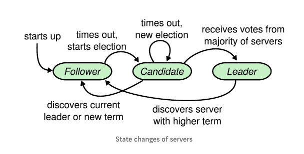

# Raft Distributed Consensus Algorithm

## 1. List of all actors
There will be five actors in our design. The actors will consist of each node that is running the program. One of these nodes will be a “leader” as defined by the raft distributed consensus protocol, with the potential for any of the nodes to become the leader in the initial selection process, or if the leader fails.

## 2. Information/control flow between the actors.
The actors can have 3 states:
* Leader: handles all client requests and manages the replication of the log to other servers
* Follower: passive state, issue no request, simply respond to requests from leader and candidate
* Candidate: used to elect a new leader

The actual data only flows in one direction: from the leader to the other servers.

*Source: [Understanding the Raft consensus algorithm: an academic article summary](https://medium.freecodecamp.org/in-search-of-an-understandable-consensus-algorithm-a-summary-4bc294c97e0d)*

## 3. The expected use cases supported by your project
Simulate a decentralized bank teller (or any decentralized distributed system that requires consensus)). We will only create one bank account for this use case with an initial balance of 0. The account will have the ability to be credited or debited from any of the five running nodes in the network.

## 4. The fault cases handled by your project
Only handle 1 fault case: A running node is terminated which might be recovered later on.

## 5. The programming language used.
Python

## 6. Any external libraries that will be used by your project.
We will use the following external libraries offered by python, however this list might change as we get further along in our implementation.
Zmq, Threading, Time, Random, Unittest, and potentially Redis

*Reference source: [simpleRaft](https://github.com/streed/simpleRaft)*

## 7. How will you expect to test your project.
* Client side test:
  * Test correct transactions (credit, debit, query)
  * Initiate transaction on any machine
* Server side test:
  * Test correct state transitions of nodes
  * Test recovering nodes will receive the correct current balance

We will run five different nodes simultaneously. Then we will log multiple credits and debits to the bank account (only one will be created for this design). Once this has been properly tested we will stop running one node and test, and then two nodes and test. We will then restart both nodes ensuring that the entire network is updated properly. Once these tests have been validated we will test that the network works when the current leader is halted so that the network must elect a new leader.

## 8. Any assumptions made in your design.
A majority of the servers are functioning properly. There are no byzantine faults.

## 9. The work breakdown structure of your design. Who will develop which part.
We plan to split the projects into two parts and each person will do one part:
* Implement the states (leader, follower, candidate)
* Implement transaction methods and logging (vote request, leader election, etc)

This structure may change as we start coding.
